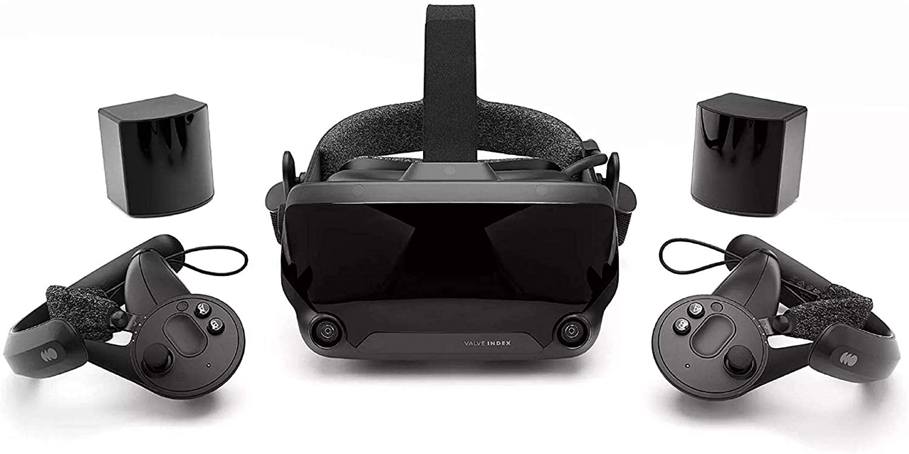
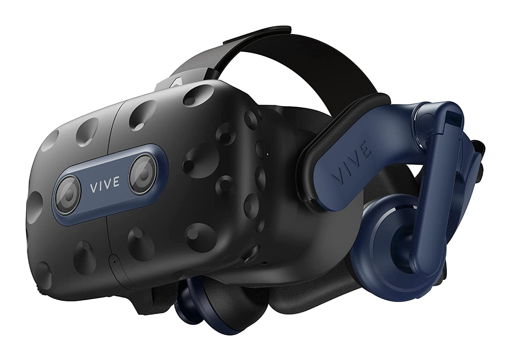
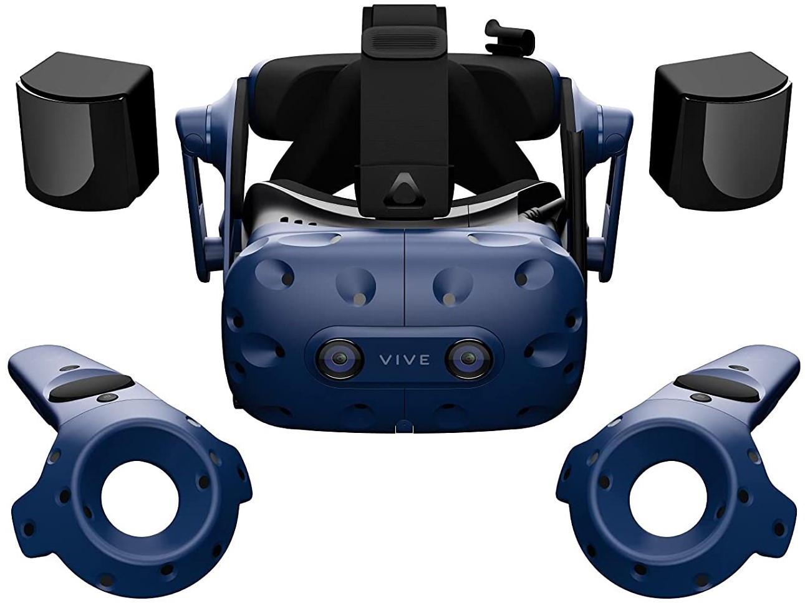
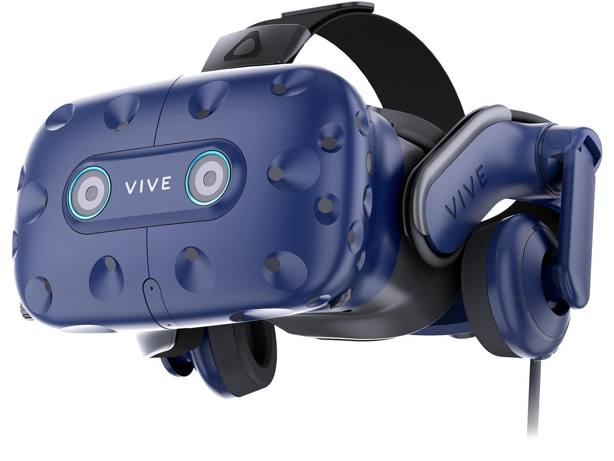
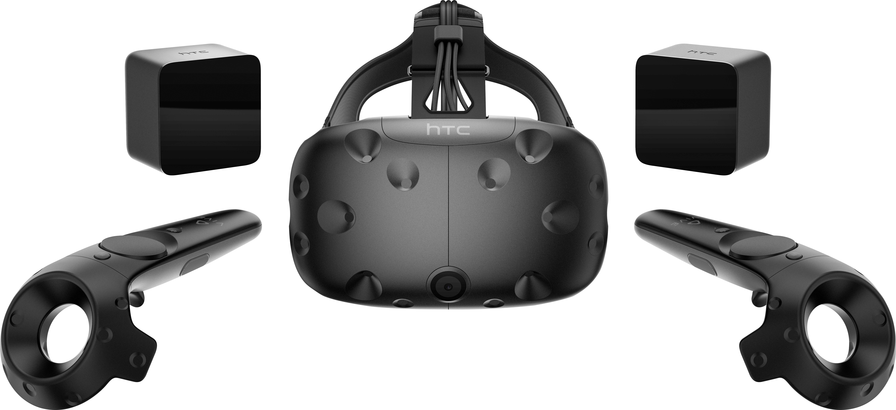
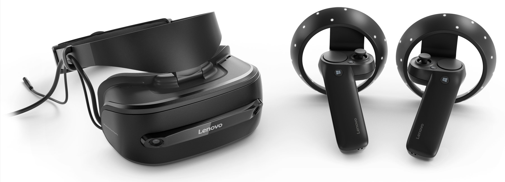
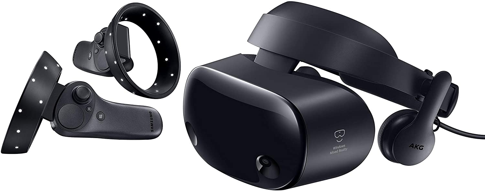
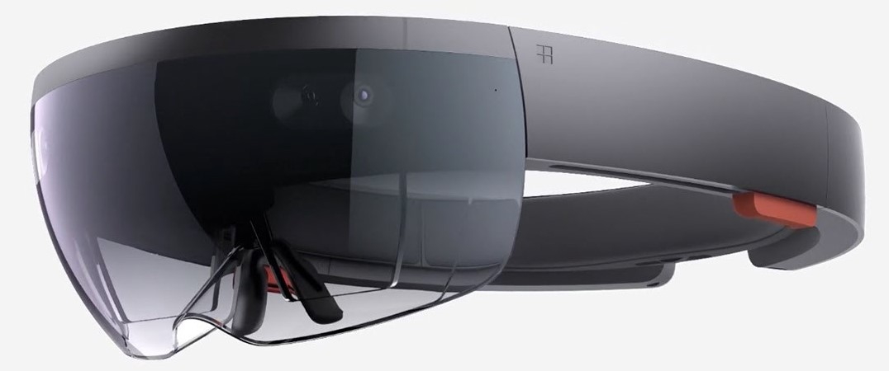
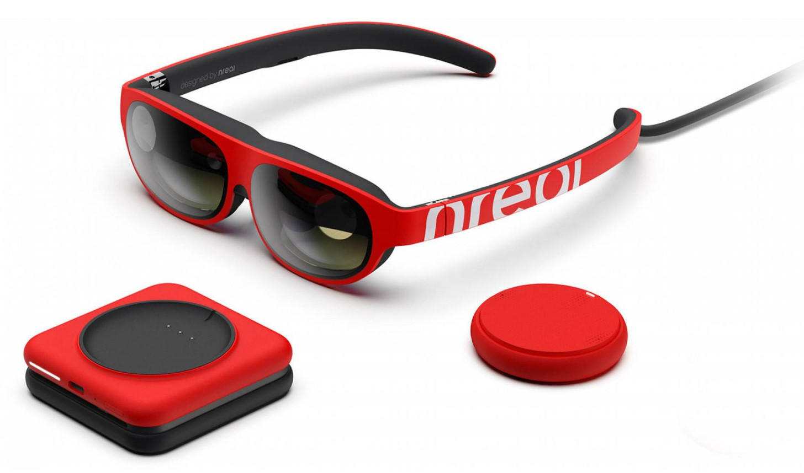
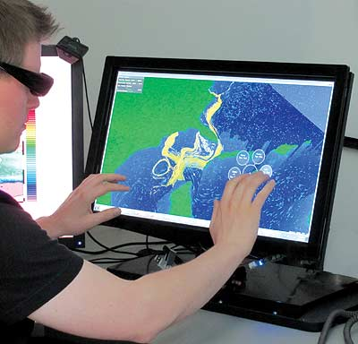

## Large Semi-Immersive TV Array

 Our large-format semi-immersive TV array uses six 82" Samsung UN82RU8000 4K televisions in portrait orientation with 15° angular offsets. The array is driven by two nVidia Quadro RTX 4000 graphics cards and is unified into a single 12960px wide by 3840px tall display through nVidia Mosaic, yielding an approximately 50 megapixel resolution.

## Mixed Reality Displays

Mixed reality encompasses technology that incorporates the real world and digital content to varying degrees. In virtual reality (VR), a headset covers your entire field of view with high-resolution displays that immerse you in a virtual environment, often paired with tracked controllers or objects that provide six-degree-of-freedom (6DOF) movement: translations and rotations about the x-, y-, and z-axes. Augmented reality (AR) devices are more like a pair of glasses, showing the real world but augmenting it with digital content anchored in the physical space. This technology is very promising for situational awareness and safety of navigation applications, and a significant thrust of our recent research has been in these areas.

### Virtual Reality Headsets
- 1x Valve Index (SteamVR) 
- 1x HTC Vive Pro 2 (SteamVR) 
- 1x HTC Vive Pro (SteamVR) 
- 1x HTC Vive Pro Eye (SteamVR) 
- 3x HTC Vive (SteamVR) 
- 1x Lenovo Explorer (WMR/SteamVR) 
- 1x Samsung HMD Odyssey+ (WMR/SteamVR) 

### Augmented Reality Headsets
- 1x Microsoft Hololens 
- 1x Nreal Light Glasses 

## Multitouch/3D Stereo Displays
- 2x 27" 1080p Active Stereo 3D Monitors with PQ Labs Multitouch Overlay
- 1x 24" 1080p Active Stereo 3D Monitor with PQ Labs Multitouch Overlay
- 1x 27" Asus PG278Q 1440p Active Stereo 3D Monitor with PQ Labs Multitouch Overlay
- 1x 40" Samsung UN40NU7100F 4K TV with PQ Labs Multitouch Overlay 

## General-Purpose Displays
- 1x 27" LG 27UD58P 4K Monitor
- 1x 75" Sony XBR-75X850F 4K TV
- 1x 65" Sharp LC-65D64U 1080P TV