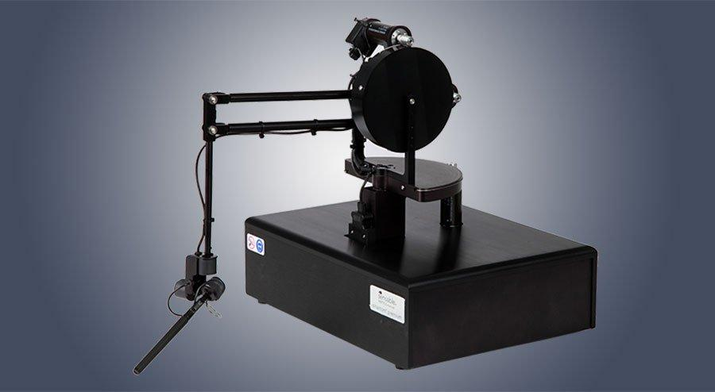
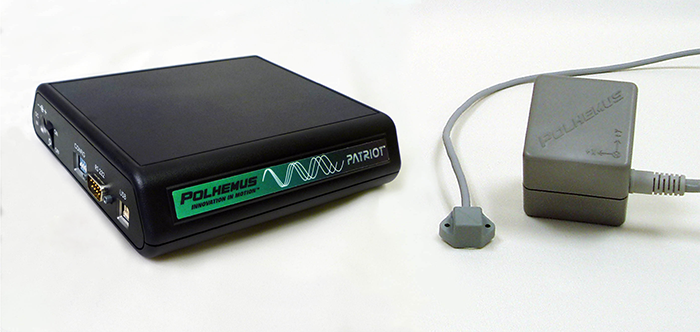

## Optical Infrared Trackers

The VisLab is outfitted with four SteamVR 2.0 Base Stations, turning the entire lab into a tracked space for virtual- and mixed-reality applications.

We also have three pairs of SteamVR 1.0 Base Stations to use with our mobile VR demonstration rig and to set up tracked spaces outside of the VisLab, such as our wave tank in the High Bay:

  
_Cleaning sonar data in VR on a floating platform with a spatial tracker_

## Haptic Devices

We have a Phantom Haptic device which provides positional and rotational information along with the ability to apply forces to the attachment at the end of the arm, providing compelling haptic feedback.

  
_The Phantom force-feedback haptic device_

## Electromagnetic Spatial Trackers

We have a variety of Polhemus electromagnetic six-degree-of-freedom (6DOF) trackers (Patriot, Fastrak, Isotrak II) and accessories. These electromagnetic trackers do not need an optical line-of-sight between the tracking source and the tracked device, allowing them to be used in crowded spaces and projects with small and/or confined tracking volumes.

  
_A Polhemus Patriot (left) with electromagnetic source cube (right) and 6DOF tracker (middle)_