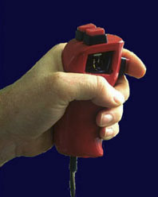
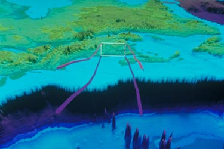
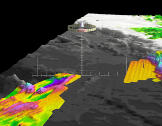

How do you get around in 3D virtual environments? Walking is out, even in a full immersive environment. One solution is to map some kind of gesture to the motion of the viewpoint.

## Flying with the Bat

  
_The bat._

  
_The predictor in an early version of Fledermaus_

Using a device called the Bat, we (Ware and Osborne, 1990) investigated various ways of mapping hand motion to viewpoint control for virtual environment. We found a "flying" method to the most flexible overall. Our interface uses hand displacement mapped to both the translational and angular velocity of the viewpoint with a non linear speed scaling. This allows people to rapidly navigate both at small and large scales. Later we added both a predictor for enhanced control and visual feedback (Chapman and Ware, 1992) and we also showed that adjusting the speed based on the local context improved performance (Ware and Fleet, 1997).

Later we developed a Center of Workspace Navigation method wherein touching an object or a point on an object moves it to the center of the virtual workspace and allows the user to zoom in and out. Interactive widgets located at that point can be used to rotate and tilt the view. This method was first used in out 3D network visualization software NV3D (Parker et al.) and later in GeoZui3D. 

The IVS (now [QPS](https://www.qps.nl)) [Fledermaus](https://www.qps.nl/fledermaus/) product began from a prototype based on the flying interface that was found to be the best. Fledermaus has also adopted the Center of Workspace Navigation method as an alternative to the flying interface.

  
_Center of Workspace widgets_

## 3D Flight for Unity Software

We have developed a 3D flight script for the Unity 3D development software using a tracked controller. It can be used with a desktop monitor or a virtual reality headset.

You can find the script and instructions here: [3D flight in Unity](/projects/unity_tools)

### References

1. Ware, C., Plumlee, M., Arsenault, R., Mayer, L.A., Smith, S. and House, D. (2001) GeoZui3D: Data Fusion for Interpreting Oceanographic Data. Oceans 2001, Hawaii, Proceedings. 1960-1964.

2. Parker, G., Franck, G. and Ware, C. (1998) Visualization of large nested graphs in 3D. Journal of Visual Languages and Computing. 9, 299-317.

3. Ware, C. and Fleet, D. (1997) [Context Sensitive Flying Interface](/pdfs/Context.pdf). 1997 Symposium on Interactive 3D Graphics, Providence RI, April. Proceedings published by ACM SIGGRAPH, 127-130.

4. Chapman, D. and Ware, C. (1992) Manipulating the Future: Predictor Based Feedback for Velocity Control in Virtual Environment Navigation. Special Issue of Computer Graphics. Proceedings of 1992 Symposium on Interactive 3D Graphics, Cambridge, MA, 63-66.

5. Ware, C. and Slipp, L. (1991) Using Velocity Control to Navigate 3D Graphical Environments: A comparison of Three Interfaces. Proceedings of Human Factors Society Meeting. San Francisco, CA, September. Proceedings, 300-304.

6. Ware, C. Using Hand Position for Virtual Object Placement. (1990) Visual Computer. 6: 245-253.

7. Ware, C. and Osborne, S. (1990) Explorations and Virtual Camera Control in Virtual Three Dimensional Enivronments. Computer Graphics. 24(2) 175-183.

8. Ware, C. and Jessome, D. (1988) Using the Bat: A Six Dimensional Mouse for Object Placement. IEEE Computer Graphics and Applications. November 8-6, 65-70.