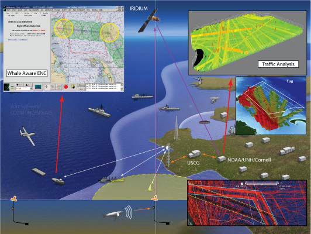

A specification is being developed to enable hydrographic and maritime safetly agencies to encode AIS message contents using XML. AIS binary messages are an effective means to digitally conmmunicate relevant ports/waterways information related to dynamic and real-time information.

### Reference

Alexander, L. , Schwehr, K. 2007. [Encoding AIS Binary Messages in XML Format for Providing Hydrographic-related Information](http://ccom.unh.edu/publications/Schwehr_07_IHR_Encoding_AIS_Binary_Messages_in_XML.pdf). International Hydrographic Review. Vol. 8, No. 2, pp. 36 - 57. Journal Article.