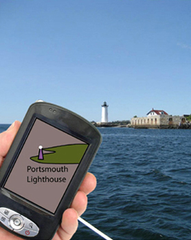
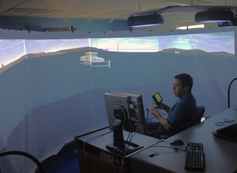

## Spatially Aware Hand-held Devices and the Boat Simulator

Small touch screen devices, such as tablet PCs and iPhones are changing the nature of what maps can be. Smart phones like the iPhone and Droid have GPS position sensors together with magnetic compasses. These make it possible to present simplified charts in such a way that navigation aids, other ships, and shore features can be cross referenced to objects on the display much more easily than is presently possible.

We have developed a ship simulator with a 180 degree panoramic display to study the potential benefits of having hand-held spatially aware navigation aids. The simulation of the real world is accomplished using the open source Flight Gear Flight Simulator. Flight Gear's fexible support for various display setups ranging from a single display to multiple displays running on different computers made it easy to congure it for our display. Making Flight Gear's airplane behave like a ship is a bit more challenging but achievable. Finally, support for custom ship models and scenery allow for the easy addition of as many navigation challenges as we need to test designs of new navigation aids.

  
_The Concept_

  
_The test environment_