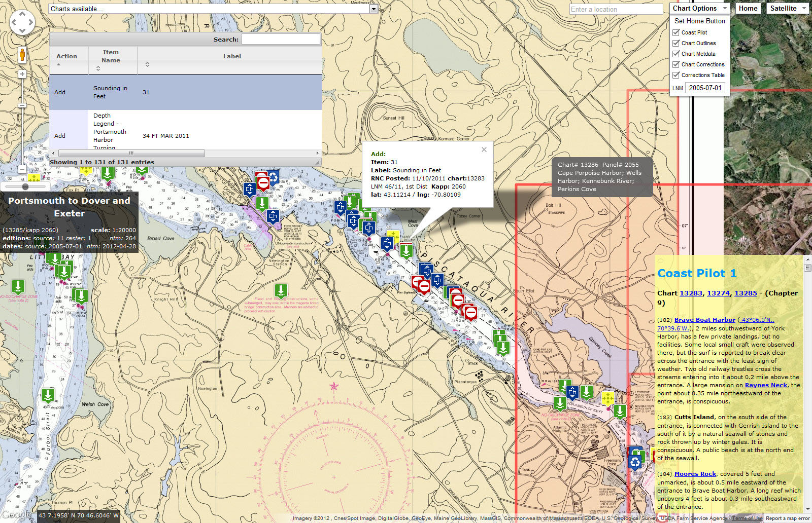
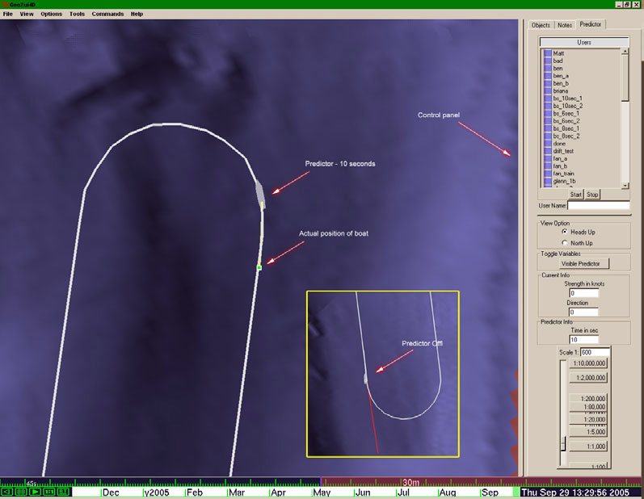
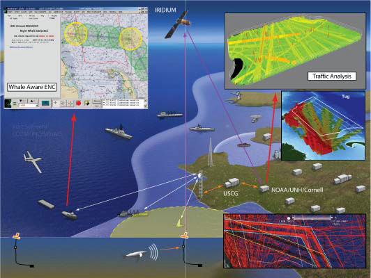

##### _Maximizing Mariner Effectiveness Through Fusion of Marine and Visualization Technologies_

The goal of the Chart-of-the-Future Project is to investigate ways to provide more effective information to the mariner in order to maximize safety and efficiency of navigation. We proceed by developing proof of concept prototypes to test new ideas and utilize new technologies. We evaluate these prototypes either through interviews with potential users or by conducting more formal human factors studies. The following is a list of sub-projects. (Click the images for larger views.)

Plumlee, M. , Arsenault, R. , Brennan, R. T., Ware, C. 2004. [The CCOM Chart of the Future Project: Maximizing Mariner Effectiveness through Fusion of Marine & Visualization Technologies](http://ccom.unh.edu/publications/Plumlee_04_MTSR_CCOM_chart-of-the-future.pdf). 7th Marine Transportation System Research and Technology Coordination Conference. Washington, DC. 16-17 November. Conference Proceeding.

[A current list of publications related to the Chart of the Future](http://ccom.unh.edu/theme/chart-future)

---

### ChUM©

The Chart Update Mashup (ChUM©) is a way to visualize critical chart corrections (from the Local Notice to Mariners) overlaid on NOAA Nautical Charts in an intuitive, geo-reference way. An interactive table allows for exploring and filtering the updates. The NOAA Chart Catalog is viewable as outlines and the NOAA Coast Pilot is automatically cross-linked with geo-referenced data to the chart. ChUM© is based on the Google Map V3 Api and accessible online at: http://vislab-ccom.unh.edu/~briana/chum/.

Learn more about [ChUM©](http://brianaccomresearch.blogspot.com/2012/06/local-notice-to-mariners-web-based.html)

_A Screenshot of the ChUM Interface_

---

### GeoCoastPilot

The main idea behind creating the GeoCoastPilot is to bring the existing Coast Pilot™ publication into the realm of modern interactive media. The information in the Coast Pilot™ books is often given piecemeal, leading mariners to read whole sections about a particular area of interest in order to pick out the few fragments that will be relevant on their next approach. The GeoCoastPilot will provide linkages between the written text, 2D and 3D views, web content, and other primary sources such as charts, maps, and related federal regulations.

Learn more about [GeoCoastPilot](https://ccom.unh.edu/vislab/projects/geocoastpilot.html).



---

### GeoNav3D

GeoNav3D integrates detailed bathymetric models, tide and current models, GPS, and sonar into a single 3D computer interface. A voyage planning feature allows for depth information to be displays at the estimated time of arrival using tidal forecasts.



---

### Panoramas

We have been conducting an investigation of ways to present photographic imagery to the mariner to better capture the utility of the early coastline sketches. Our focus has been on navigation in restricted waters, using the Piscataqua River as a test area. Through our investigation, we have developed a new method for presenting photographic imagery to the mariner, in the form of a series of panoramic images progressing down the channel.

Plumlee, M., Ware, C., Arsenault, R. and Brennan, Lt. R. 2005. [Panoramic Images for Situational Awareness in a 3D Chart-of-the-Future Display](http://ccom.unh.edu/publications/Sullivan_2006_HFES_Predictive_displays.pdf). U.S. Hydro 2005, San Diego, CA. March. CD-ROM proceedings.



---

### Predictor

Inexperienced helmsmen often oversteer because of the lag that occurs between changing the rudder angle and a change in the vessel's heading. Predictive displays are a common way of mitigating the effect of lag on human control. Accordingly we developed a predictive display to show the position and heading of a vessel a short time in the future. With this display, the helmsman's task becomes that of keeping the predictor on the planned path. In effect, the predictor is steered, not the vessel.

Sullivan, B., Ware, C. and Plumlee, M. 2006. [Predictive Displays for Survey Vessels. Human Factors and Ergonomic Studies](http://ccom.unh.edu/publications/Sullivan_2006_HFES_Predictive_displays.pdf). San Francisco, CA. 16-20 October. pp. 1-5. Conference Proceeding.

_A Screenshot of the Predictive Display_

---

### AIS

A specification is being developed to enable hydrographic and maritime safety agencies to encode AIS message contents using XML. AIS binary messages are an effective means to digitally communicate relevant ports/waterways information related to dynamic and real-time information. Learn more about [AIS](  ).

Alexander, L. and Schwehr, K. 2007. [Encoding AIS Binary Messages in XML Format for Providing Hydrographic-related Information](http://ccom.unh.edu/publications/Schwehr_07_IHR_Encoding_AIS_Binary_Messages_in_XML.pdf). International Hydrographic Review. Vol. 8, No. 2. pp. 36-57. Journal Article.

  
_A Screenshot of the AIS Display_

---

### Currents Animated on a Nautical Chart

This is an example of visualizing predicted currents in the Portsmouth, NH harbor overlaid on a Nautical Chart. Learn more about [2D flow visualization]().



---

### Contacts

For further information, contact [Colin Ware](mailto:cware@ccom.unh.edu) or [Briana Sullivan](mailto:briana@ccom.unh.edu).