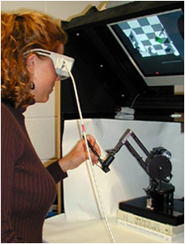
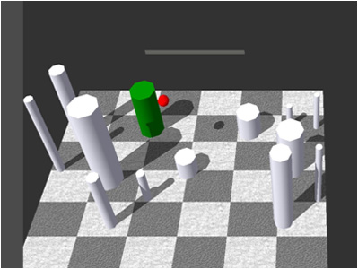

In the classic form of Virtual Reality (VR), users don a helmet and wear data gloves to get a visual impression that they are in another world. The drawback of this is a form of sensory deprivation—they have no sense of touch and are cutoff from the real world. Fish Tank VR is a term coined by Colin Ware to describe an alternative smaller virtual reality environment (Ware et al. 1993). It involves the creation of a small external virtual workspace external from the user, making it possible to have higher quality visuals, solve many of the problems of stereoscopic display, and have a sense of touch because the workspace is compatible with the spatial range of devices touch as the Phantom™ that produce a high fidelity touch haptic experience. Also, because the virtual world is small and self contained, it can exist within the real world.

One of the measurable advantages of Fish Tank VR is an order of magnitude speedup of the rate at which objects can be oriented in space (Ware and Rose, 1999).

   
_Sterescopic viewing is more important than head-coupled perspective for eye hand coordination (Arsenault and Ware, 2000)._

### References

1. Ware, C. Arthur, K. and Booth, K.S. (1993) Fishtank Virtual Reality. INTERCHI'93 Technical Paper. Proceedings 37-42.

2. Ware, C and Balakrishnan, R. (1994) Object Acquisition in VR displays: Lag and Frame Rate. ACM Transactions on Computer Human Interaction.  1(4), 331-357.

3. Ware, C. and Lowther (1997) Selection using a one-eyed cursor in a Fish Tank VR environment. ACM Transactions on CHI.4(4) 309-322.

4. Ware, C.  and Rose, J. (1999) Rotating virtual objects with real handles. ACM Transactions on CHI. Rotating virtual objects with real handles, 6(2) 162-180

5. Komerska, R., and Ware, C. (2004) A study of Linear Haptic and Pie Menus in a 3D Fish Tank VR Environment.  Proceedings IEEE Haptics Interfaces for Virtual Environments and Teleoperator Systems. Symposium. Chicago, 224-231.

6. Arsenault, R., and Ware, C. (2000) Eye-Hand Co-ordination with Force Feedback, ACM CHI’2000 Proceedings, 408-414.