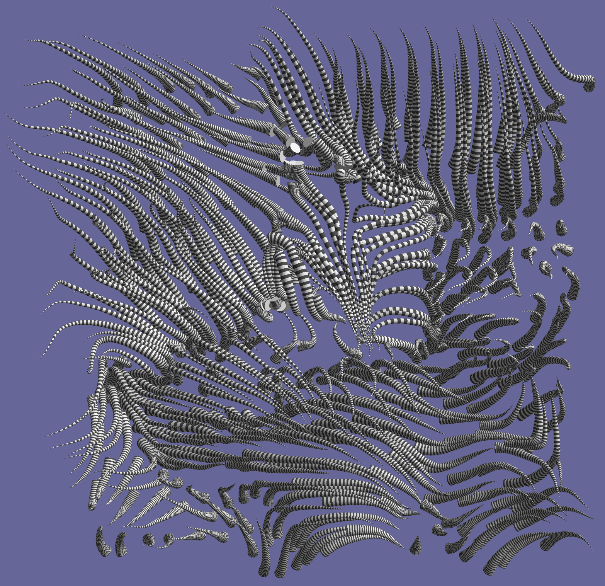
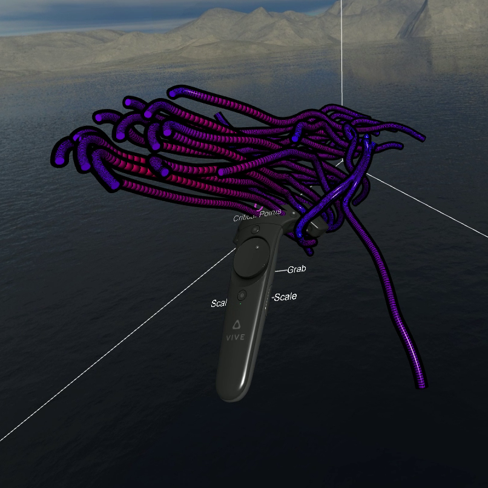
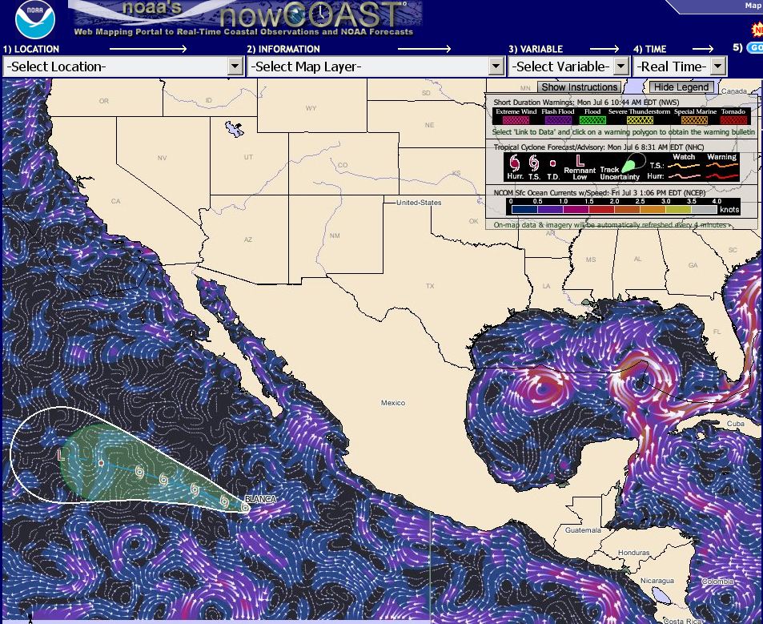
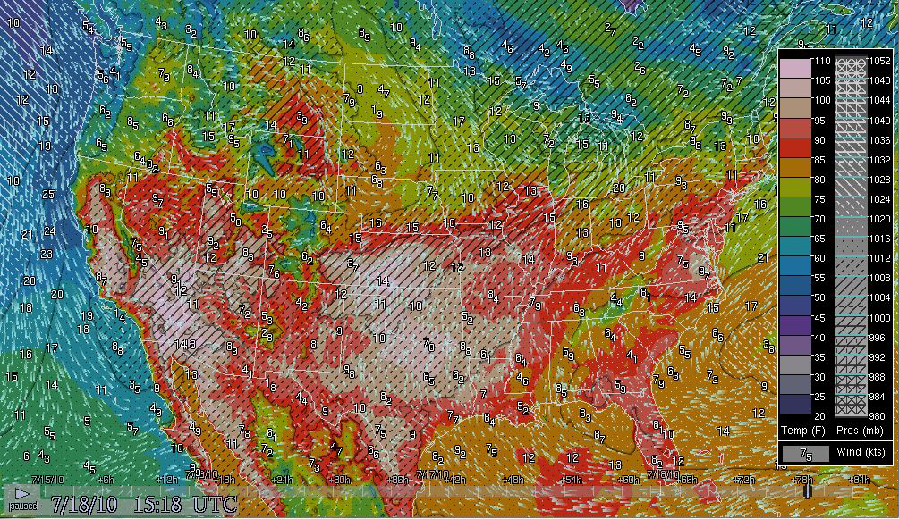
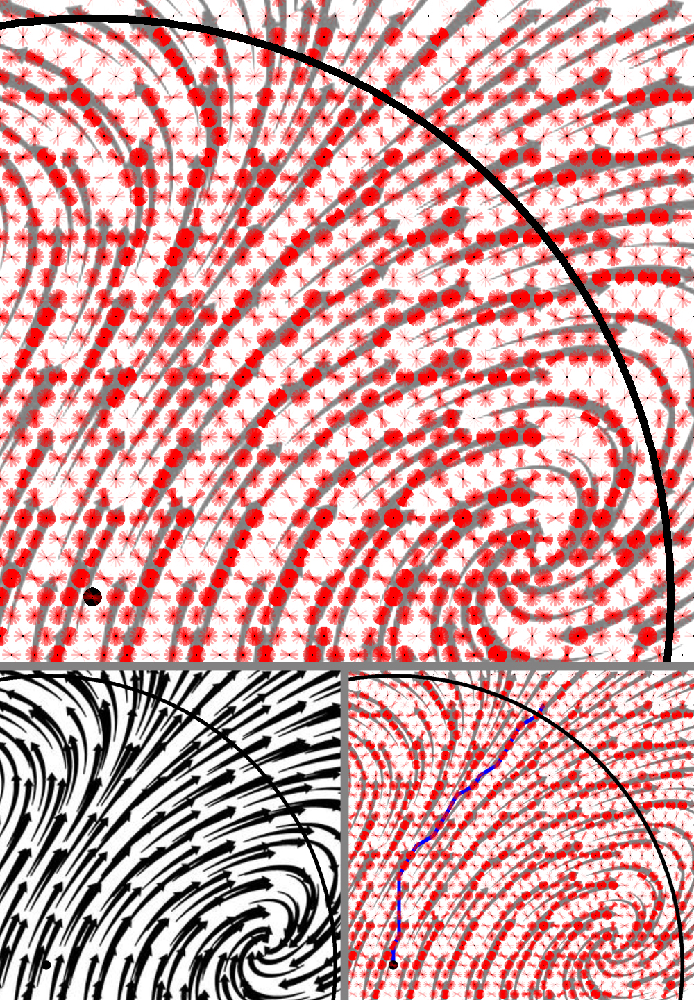
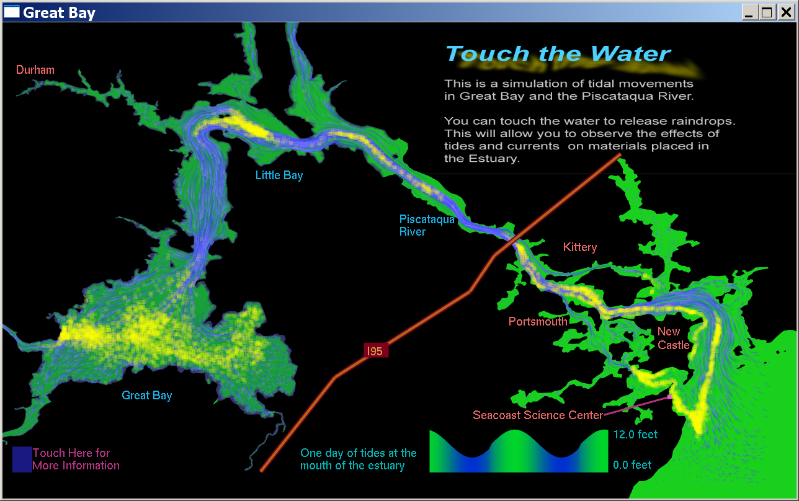
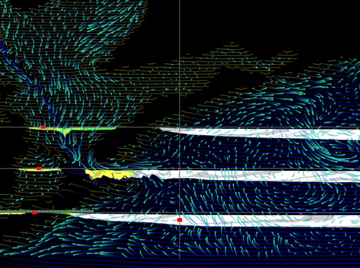
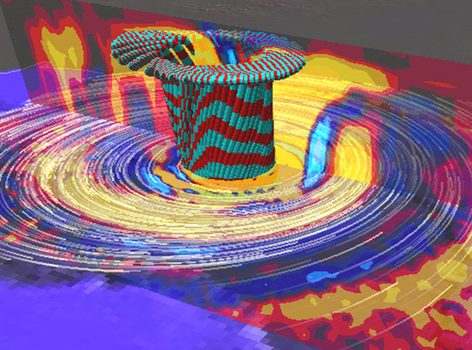

The VisLab has been working on a multi-faceted flow visualization project at CCOM. It is aimed at producing both optimized static 2D images of flow patterns and highly interactive 2D and 3D flow visualization tools. You can find descriptions of our different efforts below.

## Hairy Slices: Improving 3D Flow Vis {#hairyslices}

Visualizing 3D flow fields is a challenging task, largely due to issues of occlusion. Simple, straightforward mapping of vectors through a volume typically result in an illegible and noisy visualization. We have been investigating techniques to better present complex 3D flow fields for both static and interactive visualizations. A key aspect of our approach is to minimize occlusion by sampling on a cutting plane to reduce the dimensionality of a visualization. When a multidimensional vector field is sampled along a cutting plane and visualized using 3D glyphs, we refer to it as a "hairy slice".

Our studies have shown that shaded 3D conic glyphs yield the best perception of 3D vector direction through a cutting plane, especially when stereoscopic viewing is utilized. When textured with a regular ringed pattern, the magnitude of the local flow is also revealed.

_A hairy slice through a 3D flow field using ringed cone glyphs to improve the perception of flow direction and magnitude._

Interacting with 3D data is almost always made easier through the use of 3D controllers. The recent proliferation of low-cost consumer virtual reality headsets and easily-accessible development tools have paved the way for viewing and exploring 3D flow fields with rich depth cues provided by built-in stereoscopic viewing and motion parallax through head-tracked perspective. Direct interaction with the data using the six-degree-of-freedom (6DOF) spatially tracked controllers leads to intuitive, efficient exploration of large and complex flow fields. We have developed a set of virtual reality tools to facilitate the visualization of and interaction with 3D flow fields using the OpenXR standard.

_Interacting with a 3D flow field in real-time using our VR flow tools._

##### References:

Stevens, A. H., T. Butkiewicz, and C. Ware (2017). [Hairy Slices: Evaluating the Perceptual Effectiveness of Cutting Plane Glyphs for 3D Vector Fields](/pdfs/Hairy_Slices_1.pdf). IEEE Transactions on Visualization and Computer Graphics. 23(1), p. 990–999.

Stevens, A. H., C. Ware, T. Butkiewicz, D. Rogers, and G. Abram (2020). [Hairy Slices II: Depth Cues for Visualizing 3D Streamlines Through Cutting Planes](/pdfs/Hairy_Slices_2.pdf). Computer Graphics Forum 39(3), p. 25–35.

Stevens, A. H. (2021). [An Empirical Evaluation of Visual Cues for 3D Flow Field Perception](/pdfs/Stevens_Dissertation_2022.pdf). PhD the
sis. University of New Hampshire.

## Flow Touch 3D

Flow Touch 3D is an interactive visualization system for visualizing ocean forecast model data. It combines a multi-touch screen with a stereoscopic display and can be used to understand the effects of pollutant release or in submersible mission planning. This tool gives the user the ability to simultaneously focus on flow patterns at any depth range, while preserving the context of how those patterns relate to the rest of the model. Interactive virtual dye release devices support the exploration of particular flow structures.

Butkiewicz, T., 2012, Exploring Ocean Flow Models with a Multitouch 3D Interface, Sea Technology. p. 44-46.



## Optimized Flow Visualization

A major research goal of the vislab is to be able to produce reliably high quality visualizations of flow data. This visualization of the Atlantic and Gulf of Mexico appear on the NOAA NOS Office of Coast Survey's [nowCOAST](https://nowcoast.noaa.gov/) GIS-based web-mapping portal. It is generated by the FlowVis2D software package that has come out of this research.

Mitchell, P., Ware, C. and Kelley, J., 2009, [Designing Flow Visualizations for Oceanography and Meteorology using Interactive Design Space Hill Climbing](/pdfs/MitchellWare2009.pdf), IEEE Transactions on Systems, Man, and Cybernetics.

  
_A Screenshot of the nowCOAST Interface_

## A Better Weather Display

One of our current projects is aimed at producing a legible weather display that can simultaneously show wind speed and direction, temperature, and atmospheric pressure in a way that is both legible and which shows overall patterns well. This uses different perceptual channels for the different kinds of information. Color for temperature, texture for pressure, and animate streaklets for wind direction. We will shortly be carrying out an empirical evaluation to compare with other methods. This relies on a GPU implementation by Matt Plumlee based on a design by Colin Ware. Learn more [here](/tools/windvis2).

Fowler, D. and Ware, C. (1989). [Strokes for Representing Univariate Vector Field Maps](/pdfs/FowlerWare89.pdf). Graphics Interface Proceedings, 249-253.

  
_A Screenshot of the WindVis2 Application_

## Theory

We are developing a perceptual theory of effective flow visualization (Pineo and Ware, 2010; Pineo and Ware, 2008). In our most recent work, this involves a computational model of the primary visual cortex of the brain (V1). This is used to evaluate which flow representations are likely to best take advantage of the human brain’s contour finding mechanisms. 

Ware, C. (2008) [Towards a perceptual theory of flow visualization](/pdfs/Ware_FlowTheory.pdf). IEEE Computer Graphics and Applications. 28 (2),6-11.

Pineo, D., and Ware, C. (2010) [Data Visualization Optimization Computational Modeling of Perception](/pdfs/PineoWareTAP.pdf), ACM Transactions on Applied Perception. 7(3).

Pineo, D. and Ware, C. (2010) Neural Modeling of Flow Rendering Effectiveness. ACM Transactions on Applied Perception. 7(3).

  
_The image on the right shows a flow visualization (lower left) as it is processed by the model._

## Global Ocean Flow Patterns

In collaboration with NOAA, Northern Lights, and the Smithsonian Museum of Natural History, Colin Ware developed this visualization of global Ocean Flow Patterns. It appears animated and wrapped around the globe on the Science on a Sphere exhibit that is part of the newly renovated Sant Oceans Hall at the Museum in Washington, DC.



## Touch the Water

A museum exhibit the SeaCoast Science Center. Using a touch screen participants can learn about currents and tides in the Piscataqua. Touching the water deposits tens of thousands of particles in the flow. [With Ata Bilgili, Dartmouth]

  
_A Screenshot of the Touch the Water Interactive Application_

## SigmaView

A 3D visualizer for sigma coordinate flow models. Virtual dyepots and cutting planes can be interactively placed.

  
_A Screenshot of the SigmaView Application_

## FlowVis3D

A 3D visualizer for gridded atmospheric and ocean models. Handles nested GRIB data from NCEP hurricane forecasts.

  
_A Screenshot of the FlowVis3D Application_