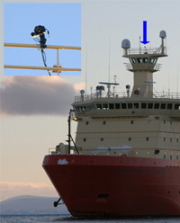
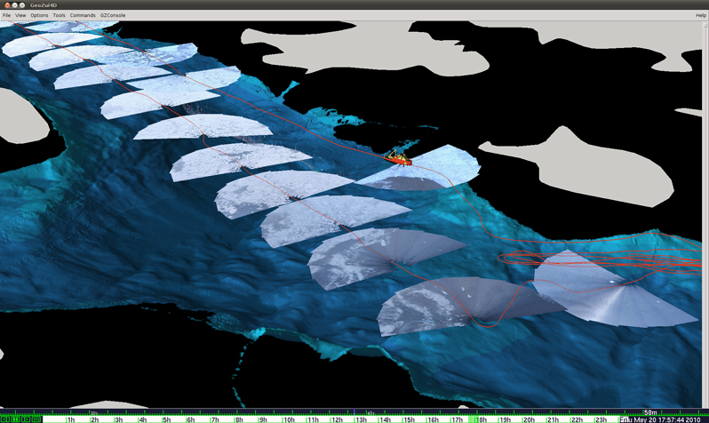
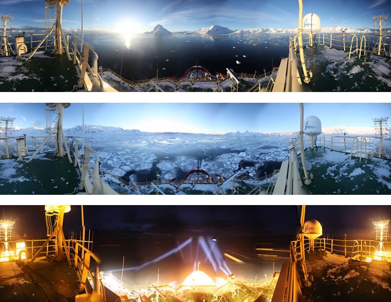

In 2010, the VisLab initiated a new project to use a georeferenced camera to map ice. The camera is mounted on a digital pan-tilt head that can provide accurate attitude sensing combined with ship attitude, heading and position sensing. Software developed by Roland Arsenault takes set of photographs, orthorectifies and mosaics them to produce an accurate representation of ice conditions in the vicinity of the ship. This system was developed and deployed on the N.B. Palmer in Antarctica in May 2010. It consisted of a Canon SLR mounted on a digital pan-tilt head attached to the railing on the Palmer’s Ice Tower approximately 60 m above the waterline. The purpose of the project is to understand how whale, krill, seals, and other animals are distributed with respect to different ice conditions.

  
_A Canon SLR (inset) was mounted on the PALMER's ice tower._

A set of 750 meter radius orthorectified images was created along the path of the ship with minimal distortion (see below). This project is a collaboration with Patrick Halpin of Duke University. Halpin has successfully demonstrated that a supervised image segmentation method can be used to classify ice types (grease ice, brash ice, and consolidated ice).

Below are panoramas showing different ice conditions at different times of the day. These images were generated by the GeoCam mounted on the NB Palmer in Antarctica in May 2010.

