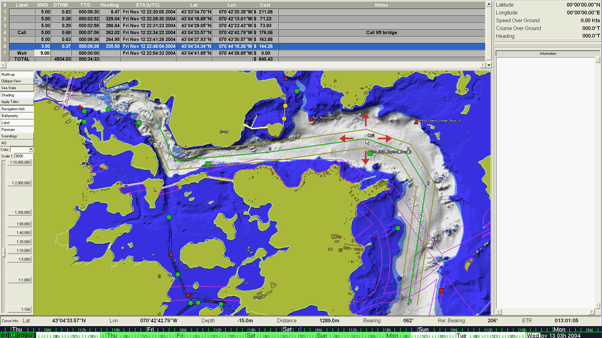
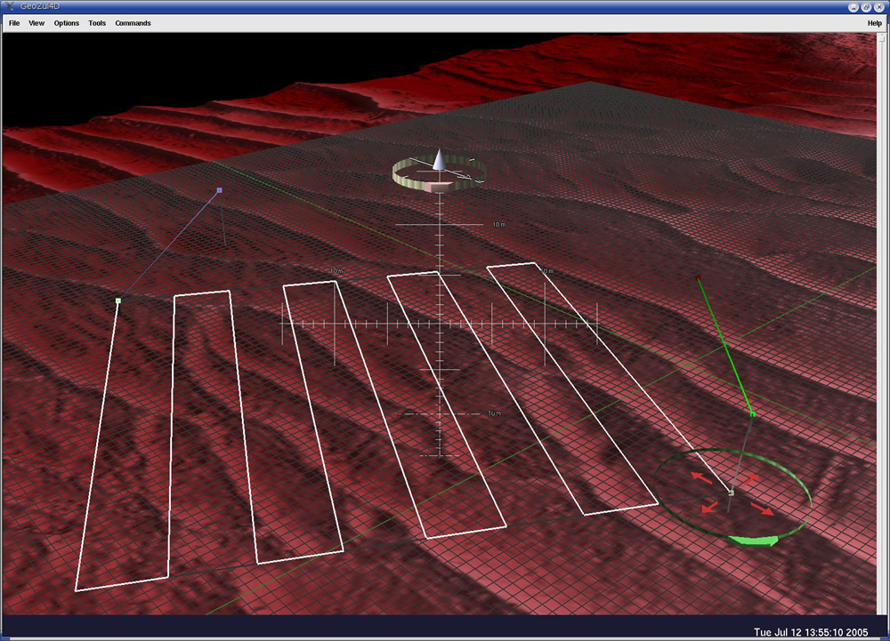

## _"Zooming in Space and Time"_

GeoZui4D stands for Geographic Zooming User Interface 4D. The 4D refers to the fact that it allows users to interactive with data that varies both in space and time.

GeoZui4D is a platform for developing innovative approaches to visualization time-varying geospatial data. Over the years it has been the platform for many threads of research. (Please click the images for larger views.)


Zooming in time as well as space  
([Arsenault et al. 2004](http://ccom.unh.edu/sites/default/files/publications/Arsenault_2004_Oceans_System_for_Visualizing_Time_Varying_Ocean_Data.pdf))

  
[The Chart of the Future]()  
(Plumlee et al.)

  
Haptic Interaction  
([Komerska and Ware, 2003](/pdfs/HapticGeoZui3D_VR2003.pdf))


Studies of how best to link multiple views of the same data space  
([Plumlee and Ware, 2003](/pdfs/Linking_Methods.pdf))


And most recently, the real-time visualization of sonar data

In addition, GeoZui4D makes excellent HD videos.

GeoZui4D has been developed mostly by Roland Arsenault and Matt Plumlee, based on an original concept by Colin Ware.

[Download GeoZui4D](http://vislab-ccom.unh.edu/GeoZui4D/Downloading.html)

See the [User Manual](http://vislab-ccom.unh.edu/GeoZui4D/Manual.html)

### References

1. Martin S.C., L.L. Whitcomb, R. Arsenault, M. Plumlee, and C. Ware. 2005. [Advances in Real-Time Spatio-Temporal 3-D Data Visualization for Underwater Robotic Exploration](/pdfs/SCM_Geozui_book_chapter_2005.pdf), in Advances in Unmanned Vehicles, edited by Geoff Roberts and Robert Sutton. IEE Control Engineering Series, IEE Press.

2. Plumlee, M., C. Ware, R. Arsenault, and Lt. Richard Brennan. 2005. [Panoramic Images for Situational Awareness in a 3D Chart-of-the-Future Display](http://ccom.unh.edu/sites/default/files/publications/Plumlee_05_HYDRO_Panoramic_images_for_situational_awareness.pdf). U.S. Hydro 2005, San Diego, CA. March. CD-ROM proceedings.

3. Plumlee, M., Arsenault, R., Brennan, R., Ware, C. [The CCOM Chart-of-the-Future Project:  Maximizing Mariner Effectiveness through Fusion of Marine & Visualiation Technologies](http://ccom.unh.edu/sites/default/files/publications/Plumlee_04_MTSR_CCOM_chart-of-the-future.pdf). 7th Marine Transportation System Research and Technology Coordination Conference (MTS R&T ‘04), Washington, DC. Nov. 16-17, 2004. 

4. Arsenault, R., C. Ware, M. Plumlee, S. Martin, L. Whitcomb, D. Wiley, T. Gross, and A. Bilgili. 2004. [A System for Visualizing Time varying Oceanographic 3D Data](http://ccom.unh.edu/sites/default/files/publications/Arsenault_2004_Oceans_System_for_Visualizing_Time_Varying_Ocean_Data.pdf). Oceans '04 Techno-Ocean '04 (OTO'04) Conference Proceedings. 743-747.

5. Komerska, R., and Ware, C. 2003. [Haptic GeoZui3D: Exploring the use of Haptics in AUV path planning](http://ccom.unh.edu/sites/default/files/publications/Komerska_03_UUST_Haptic_GeoZui3D_AUV_Path_Planning.pdf). 13th Unmanned, Untethered Submersible Technology Symposium. CD-ROM Proceedings.

6. Plumlee, M., and Ware, C. 2003. [Integrating multiple 3D views through Frame-of-Reference Interaction](/pdfs/2003_Plumlee_IntegratingMultiple_3D_Views.pdf). International Conference on Coordinated and Multiple Views. London, July.

7. Plumlee, M., and Ware, C. 2003. [An Evaluation of Methods for Linking 3D Views. ACM 2003 Symposium on Interactive 3D Graphics](/pdfs/Linking_Methods.pdf). May, Monterey. 193-201.

8. Plumlee, M. and Ware, C. 2002. Modeling performance for zooming vs multi-window interfaces based on visual working memory. Advanced Visual Interface, Trento Italy, May. Proceedings, 59-68.

9. Ware, C., Plumlee, M., Arsenault, R., Mayer, L.A., Smith, S., and House, D. 2001. [GeoZui3D: Data Fusion for Interpreting Oceanographic Data](http://ccom.unh.edu/sites/default/files/publications/Ware_2001_Oceans_GeoZui3D_data_fusion_for_interpreting_oceanographic_data.pdf). Oceans 2001, Hawaii, Proceedings. 1960-1964.