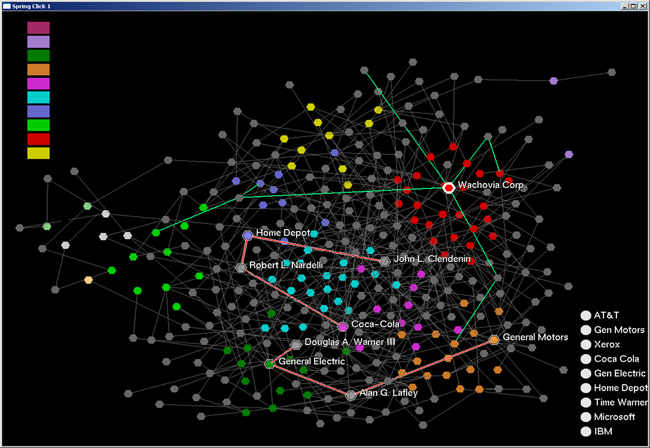
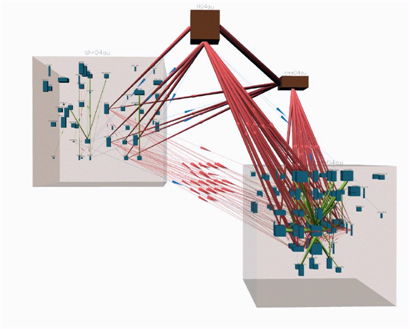

## Visualizing Large Information Networks

One of the most important ways of visualizing information structures is using node-link diagrams. But a conventional node-link diagram can only have about 30 nodes before it becomes unreadable. Today’s information structures are huge, often having thousands of nodes and links.

We have been investigating methods for expanding the size of diagrams that can be usefully explored by at least an order of magnitude. In collaboration with BBN, Ware invented an interactive motion highlighting technique that has been patented. The user simply moves the cursor over a node and relevant information becomes rapidly highlighted through a topological range search (Ware and Bobrow, 2005).

  
_MEGraph showing the largest connected component of Fortune 500 companies. Links are through common board of director members (grey dots). MEGraph stands for Motion Enhanced Graph._

A separate line of research (Ware and Frank, 1996; Ware and Mitchell 2008) has shown that stereoscopic 3D viewing and enabled graphs with more than a thousand nodes and links to become interpretable. This lead to the development NV3D, a system for visualizing large information structures in 3D including large software structures. NV3D was developed between 1993 and 1997 in Colin Ware's Lab at the University of New Brunswick (Parker et al. 1998).

  
_NV3D showing the software architecture of a large digital switch. NV3D stands for Nested Vision 3D._

### References

1. Ware, C., Gilman, A.T., and Bobrow, R.J. (2008) Visual Thinking with an Interactive Diagram. Lecture Notes in Artificial Intelligence. 5223. 118-126. 

2. Ware, C. and Mitchell, P. (2008) Visualizing Graphs in Three Dimensions. ACM Transactions on Applied Perception. 5(1). 2:1-15.

3. Ware, C., and Bobrow, R., (2005) Supporting visual queries on medium sized node-link diagrams. Information Visualization. 4 (1), 49-58.

4. Ware, C., and Bobrow, R. (2006) Motion Coding for Pattern Detection. Proceedings, ACM SIGGRAPH Symposium on Applied Perception in Graphics and Visualization (APGV). 107-110.

5. Parker, G., Franck, G., and Ware, C. (1998) [Visualization of large nested graphs in 3D](/pdfs/visualnav.pdf). Special issue of the Journal of Visual Languages and Computing. 9, 299-317.

6. Ware, C., Franck, G., Parkhi, M., and Dudley, T. (1997) [Layout for Visualizing Large Software Structures in 3D](/pdfs/LayoutPaper-Vis97.pdf). Proceedings, VISUAL'97. San Diego, December. 215-223.

7. Ware, C. and Franck, G. (1996) [Evaluating Stereo and Motion Cues for Visualizing Information Nets in Three Dimensions](/pdfs/TOGGraph_Net%20.pdf). ACM Transactions on Graphics. 15(2) 121-139.

8. Gobrecht, C., Bhavsar, V., and Ware, C. (1996) PVMtrace: A 3D distibuted program visualizer. 10th International Conference on High Performance Computers. HPCS'96 CDROM Proceedings, Carleton University Press and IEEE Canada Press. Otttawa, June.