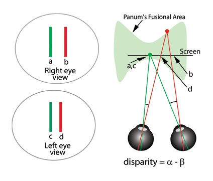

Stereopsis referers to our brain's ability to extract depth information from differences between the images in our two eyes. We have developed algorithms to overcome or reduce problems with stereo displays. Before explaining, a brief introduction to stereo vision is needed. Differences between points in images presented to the two eyes are called disparities which the brain can use to infer relative depths between points in the environment. There are a number of problems with stereoscopic computer displays because of the limited depth information available in human perception.

The above diagram illustrates a simple stereoscopic display. On the left are the views presented to the two eyes. If a and c are fixated by the right eye and left eye respectively, the brain fuses c and d and interprets the result as a line behind the screen as shown on the right. Disparities are the differences between the angles subtended between pairs of features (alpha - beta). There are a number of problems with screen-based stereo displays. First, if disparities are too large, the result is seeing double (diplopia). The area in which the images can be fused is called Panum's fusional area and this is remarkably small in the worst case.

A second problem is that objects more than 30 meters away have images on the retina that are so similar the brain cannot obtain any useful disparity information. A third problem is called vergence focus conflict—this has to do with the coupling of the focusing mechanism in the eye with the mechanism that makes the eyes converge when we see objects at different distances. Computer graphics systems can provide the correct information for vergence but not focus and this may cause eye strain. Fourthly, frame cancellation occurs for an object shown in front of the screen as shown below. An object clipped by the edge of the screen is interpreted as being occluded by the screen border and because occlusion is the strongest depth cue, the depth effect collapses. 

Our cyclopean scale as illustrated below is an algorithm to solve or reduce a number of these problems.

The basic idea is to scale the whole scene to about the midpoint between the viewer's two eyes (hence cyclopean) until the near point lies just behind the screen. This

* removes the possibility of frame cancellation,

* brings far objects closer where stereo depth becomes available, and

* reduces vergence focus conflict.

Cyclopian scale is just the first stage in processing. The next step is to adjust the virtual eye separation to make a comfortable amount of depth.

### Reference

1. Ware, C., Gobrecht, C., and Paton, M. (1998) Dynamic adjustment of stereo display parameters. IEEE Transactions on Systems, Man and Cybernetics. 28(1) 56-65.