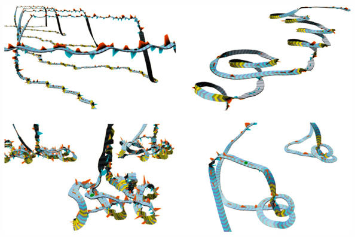

A class of digital recording tags has been developed that can be attached to marine mammals and thereby record the animals movements and vocalizations over a period of 24 hours or more. Examples of such tags are Dtag, CritterCam, Daily Diary and Acousonde. These tags contain accelerometers, magnetometers and pressure sensors.

TrackPlot™ is a software package designed to help analyze kinematic patterns from tag data. This package allows for novel kinematic patterns to be rapidly identified and analyzed. It also allows for the pseudo-track to be georeferenced if a set of surface fix locations exist. And it allows for sound to be played synchronously with movement.

Download TrackPlot™ [Here](TrackplotPkg_2012.zip)

DownLoad TrackPlot3.0™ [Here](TrackPlot3.0_installer.zip)

This software is still somewhat experimental. Please contact [Colin Ware](mailto:cware@ccom.unh.edu) for help in using it.

### Funded by ONR N0014091601

### References

1. Ware, C. Friedlaender, A.S. , Nowacek, D.P. (in press) Shallow and Deep Lunge Feeding of Humpback Whales in Fjords of the West Antarctic Peninsula. Marine Mammal Science.

2. Hazen, E.L., Friedlaender, A.S., Michael A. Thompson, Ware, C., Weinrich, M.T., Halpin, P.N and Wiley, D.N. (2009) Fine-scale prey aggregations and foraging ecology of humpback whales (Megaptera novaeangliae). Marine Ecology Progress Series. 395. 75-89.

3. Friedlaender, A.S., Hazen, E.L., Nowacek, D.P., Halpin, P.N. Ware, C., Weinrich, M.T., Hurst, T., and Wiley, D. (2009) Diel Changes in Humpback Whale (Megaptera Novaeangliae) feeding behaivior in response to sand lance (Ammodytes SPP.) Behavior and Distribution. Marine Ecology Progress Series. 395, 91-100.

4. Ware, C., Arsenault, R., Plumlee, M. & Wiley, D. (2006) Visualizing the Underwater Behavior of Humpback Whales. IEEE Computer Graphics and Applications, July/August issue. 14-18.