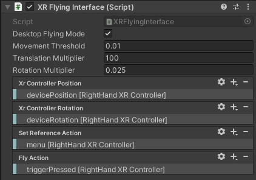

This script enables [3D flight](/projects/3d_navigation) using a tracked controller in Unity through OpenXR. The flying interface works in virtual reality ~~and outside of VR with a standard desktop monitor~~. It is released for general use under the [BSD 3-Clause License](https://opensource.org/licenses/BSD-3-Clause).

**Note:** Desktop Flying is deprecated because the OpenXR specification [does not currently support `headless mode'](https://www.khronos.org/registry/OpenXR/specs/1.0/html/xrspec.html#sync_frame_loop) (i.e., using XR input devices without rendering to a headset). 

**>> Download the [XR Flying Interface script.](XRFlyingInterface.cs) <<**

## Configuration

  
_Configuration and options of the XR Flying Interface script_

#### VR Flying Setup

1. Add the script to the XR Rig
2. Make sure the "Desktop Flying Mode" box is unchecked.
3. Bind the tracked controller position to the "Xr Controller Position" action
4. Bind the tracked controller rotation to the "Xr Controller Rotation" action
5. Bind a button on the tracked controller to the "Fly" action.

#### ~~Desktop Flying Setup~~ (DEPRECATED - Not Supported by OpenXR)

1. Add the script to the main camera.
2. Make sure the "Desktop Flying Mode" box is checked.
3. Bind the tracked controller position to the "Xr Controller Position" action
4. Bind the tracked controller rotation to the "Xr Controller Rotation" action
5. Bind a button (typically on the tracked controller) to the "Set Reference" action
5. Bind a button on the tracked controller to the "Fly" action.

## Flight Instructions

~~For desktop flying, the script needs to know where your monitor is located in the tracked space, so you must first set your reference with regard to the monitor. To do this, Point your controller at your monitor and press the "Set Reference" button you bound in the script options. Your controller movements will now control the 3D flight relative to this monitor reference. You do not need to set a reference for VR flying.~~

When 3D flight is activated, the tracked device/controller becomes a "control stick" for a flying vehicle, directly controlling both the spatial velocity and angular velocity of the camera (or XR Rig).

To move in a direction, activate flying (e.g., hold down the trigger on the controller) and then physically move the tracked controller in the direction you want to travel. The further you move the controller from the point of flight activation, the faster you will travel.

To rotate the camera, activate flying and rotate the controller in the direction you want the camera to rotate. For example, to rotate the camera upwards, activate flying and then pitch the controller upwards.

You may need to adjust the translation and/or rotation multipliers in the script options to tune the 3D flight to your scene. See below for more info.

## Options

- ~~**Desktop Flying Mode:** Check this box to use a tracked controller with a desktop monitor instead of an HMD. See flight instructions above.~~
- **Movement Threshold:** The distance the controller must move after flying is activated to begin 3D flight. Rotations are always available when flying is activated.
- **Translation Multiplier:** The velocity of flight is determined by the cubed displacement of the controller and multiplied by this value:  
_Displacement³ × Translation Multiplier = Positional Velocity_
- **Rotation Multiplier:** The angular velocity of the 3D flight is modulated by this multiplier:  
_Angular Displacement × Rotation Multiplier = Angular Velocity_

Bug reports, feature requests, and other inquiries can be emailed to [Drew Stevens](/people/drew_stevens) (astevens@ccom.unh.edu) at the VisLab.