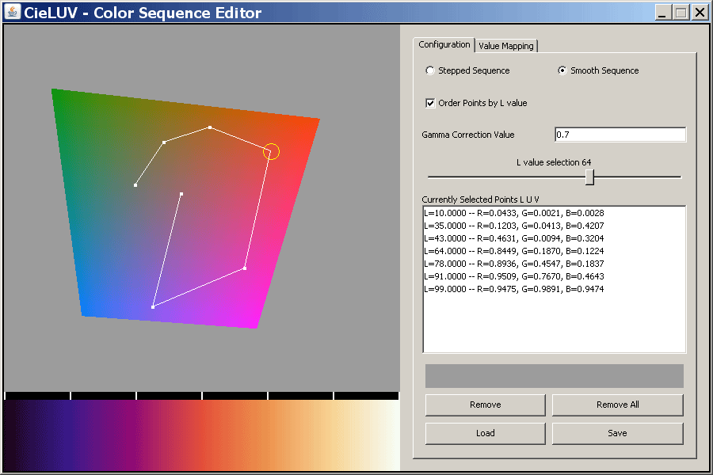
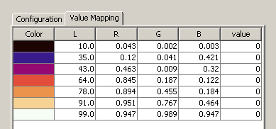

## Color Sequence Editor Using CIEluv Uniform Color Space

#### Evan Oliveri and Colin Ware

This page describes a freely downloadable color sequence editor called CIEluv_CSE. It is optimized to create "spiral color sequences" (Ware, 1988). Read on to find out what a spiral color sequence is and why it is a good idea.

Pseudo-color sequences are sequences of colors used to visually code scientific data, such as weather maps or astronomical radiation maps. An example is shown to the right. Various researchers have suggested that a good color sequence should increase continuously in luminance (or lightness) (Ware, 1988; Boreland and Taylor, 2007). This is because the shape perception mechanisms of human vision operate primarily through the so-called "luminance channel" as opposed to the "chromatic channels". On the other hand, if it is important to be able to read values accurately using a key (think of the key of a weather map), having a sequence that traverses through a lot of colors makes for more accuracy. Thus, the ideal color sequence should be one that cycle through a lot of colors while continuously increasing in luminance.

Another issue in color sequence design is the size of the gaps between adjacent colors. Sometimes researchers want colors separated in perceptually equal steps. Sometimes it is useful to have colors bunched up for certain data ranges. A method for creating perceptually equal steps can be based on a concept from color science called the uniform color space. A uniform color space (UCS) enables the transformation of the Red, Green and Blue monitor colors into a space so that equal distances on the screen should produce a standard amount of color difference. In our CIEluv_CSE editor we used the Commission International d'Leclairage's CIEluv UCS color transformation (Schanda, 2007).

  
_The CIEluv\_CSE_

You can download the Java application here: [CIEluv_CSE](http://vislab-ccom.unh.edu/~cware/ColorSequenceEditor.jar)

## User Manual

The figure above shows the user interface for the CIEluv_CSE editor. The big square window shows a slice through the Red, Green Blue color cube that has been transformed into CIELuv. The slice is at a particular luminance level. You can drag the L value slider to the left and right to go from black to white and though all the available colors in between.

To add a new point in the sequence just click somewhere on the colored patch in the main window. The color will appear in the sequence below.

Try repeatedly moving the L slider and adding another color each time. The colors will be automatically sorted from dark to light. If you prefer a smoothly varying color sequence you can click on the Smooth Sequence button in near the top right of the panel. Try it, you can easily switch back. You can also choose not to have colors sorted in lightness.

To change one of the colors in your sequence you can select it, either by clicking on the color in the sequence at the bottom, or by clicking on the color as it appears in the list to the right. Once you have done that you can change the hue by dragging in the main window, or you can delete it with the Remove button.

The gamma correction value can be used to partially correct for non-linearities of your monitor. A value between 0.6 and 1 is recommended. One you change this you will have to wait a minute while it computes a new set of slices.

If you want to see an sample of the color under the cursor, you can hold down the Ctrl key while moving the cursor over the CIEluv display window.

In order to save and reload sequences you have generated, you will have to accept the security certificate when running through java webstart.

  
_It is often desirable to associated values with colors when creating a color sequence. The table you get with the Value Mapping tab supports this. You can add values in the right hand column._

### References

1. Borland, D., and Taylor, R. M. (2007) Rainbow color map (still) considered harmful. IEEE Computer Graphics and Applications, March/April, 14-17.

2. Ware, C. (1988) Color sequences for univariate maps: Theory, experiments and principles. IEEE Computer Graphics and Applications. 41-49.

3. Schanda, J. (2007) Colorimetry: understanding the CIE system. Wiley Interscience.

4. Mahny, M., Vaneyecken, L and Oosterlinka, A. (1994) Evaluation of uniform color spaces after the adoption of CIElab and CIEluv. Color research and application. 19(2) 105-121.