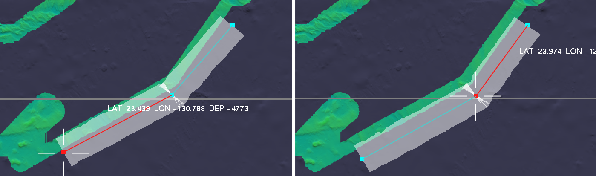

The BathyGlobe GapFiller is a software tool designed to support planning for transit and area mapping.

To efficiently map the oceans in support of the SeaBed 2030 project, new multibeam lines should ideally slightly overlap prior mapping.  Gap filler provides the latest versions of Seabed 2030 bathymetry as context for planning.

#### >> Download [BathyGlobe GapFiller v2.1](/downloads/BathyGlobe_GapFiller_v1.zip) (~4.5 GB) <<

The instruction manual included in the download can also be accessed [here](/downloads/BathyGlobeGapFillerManual_2.1.pdf).

It is released for general use under the [BSD 3-Clause License](https://opensource.org/licenses/BSD-3-Clause).

## Features

  
_An example using the Automatic Overlap Adjustment tool._

- ##### Automatic Overlap Adjustments:
  Ideally, when planning transits new swaths should abut and slightly overlap existing mapped areas. To support the planning of tracklines meeting this requirement the GapFiller application can adjust overlap with existing mapped areas to meet a specified amount of overlap.  
  
- ##### Polygon Filling:
  GapFiller allows the user to draw a polygon, which can then be filled automatically with planned track lines.  As polygons are filled the overlap of successive swaths is automatically adjusted based on local depth estimates. Multiple polygons can be linked to form a survey plan.  

- ##### Plan Statistics:
  GapFiller can compute mapping statistics, based on a transit or survey plan. These include total area mapped, overlap with existing mapping, self-overlap, and area of new mapping.

- ##### Automatic Transit Planning:
  Where long transits are planned, the software can generate a sequence of waypoints defining swaths that wherever possible will abut existing mapping while adding only a minimal cost in terms of extra distance travelled.

## Contact

Questions and comments regarding BathyGlobe GapFiller can be sent to [Colin Ware](mailto:cware@ccom.unh.edu).