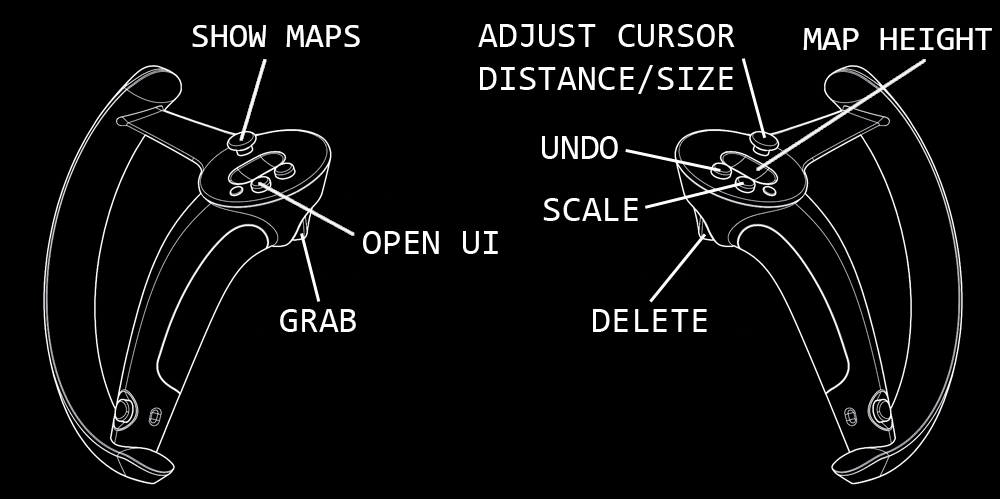
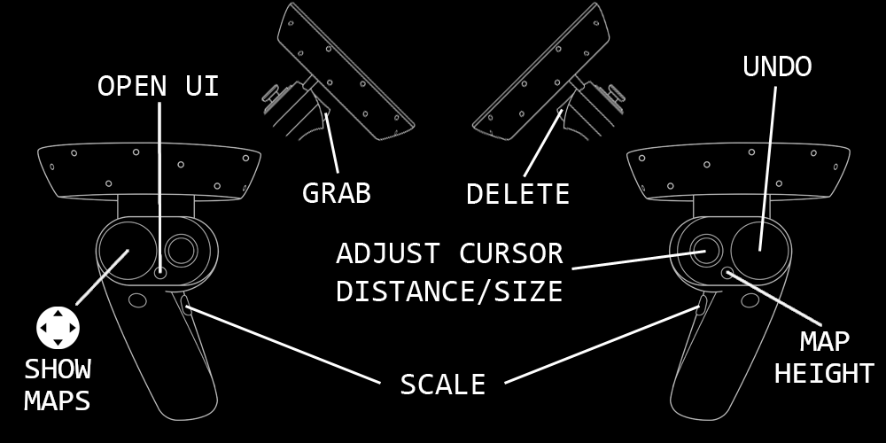
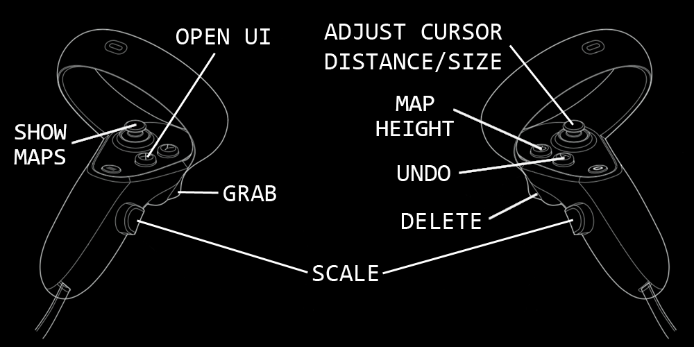

This VR app was built with our [Point Cloud Plugin](/tools/point_cloud_plugin) for Unity.

Using simple two-handed interactions, you can examine and edit your point clouds to remove unwanted noise or objects quickly and intuitively in a fraction of the time it would take on a desktop. You can [read more about our point cloud research](/projects/point_clouds) as well.

**Download the [XR Point Cloud Cleaner](xrpcc-0.1.zip).**

It is released for general use under the [BSD 3-Clause License](https://opensource.org/licenses/BSD-3-Clause).

## Instructions

Point clouds are **loaded** using the user interface (UI) attached to the left-hand controller. Press the `Open UI` button (see controller layouts below) to view the options. Use the right-hand controller to point at a menu item and pull the trigger to select it.

A simple file system browser will open up when you choose to load a point cloud. Navigate to the location of the .las or .laz file you want to open, and either double-click the file or select the file and then click the `Load` button.

It may take some time to process, depending on the file size.

A point cloud can be **unloaded** or **closed** by selecting its filename in the UI dropdown menu, and then clicking the `Close` button.

Interacting with point clouds is easy. Pressing the trigger on your left-hand controller will **grab** the point cloud and allow you to quickly reorient it as desired. **Scaling** the point cloud is done by holding the `Grip` buttons on both controllers (or just the `A` button on the right-hand Valve Index controller) and spreading the controllers farther apart to increase the scale, or bringing them closer together to decrease the scale of the point clouds. Scaling occurs about the midpoint between the two controllers, indicated by a 3D icon that looks like a multicolored jack. Scaling can be a very effective way to move about and examine your point clouds while helping to maintain the overall context of the data.

Once a point cloud has been loaded, we can quickly identify and get rid of most egregious **noise** and **outliers** using the options at the bottom of the UI panel:
* **Distance** sets the minimum distance at which a point will be considered an outlier. Lowering this parameter will cause points closer together to be considered outliers.
* **Neighbors** sets the maximum number of neighboring points contained within the given distance from the candidate point in order for that candidate to still be considered an outlier. For example, a value of 3 would mean that if there are any more than 3 neighboring points within the set distance for the candidate point, it will not be considered an outlier.

Clicking the `Show` button will visualize the outlier points in red. Click the `Delete` button to get rid of the highlighted outlier points.

In addition to the rapid outlier deletion tool, there is a spherical **3D editing cursor** attached to the right-hand controller. This cursor is suitable for large, coarse editing, as well as more precise, fine-grained cleaning tasks. Points within the editing cursor will blink; pressing the trigger on the right-hand controller will **delete** the points within the sphere.

The editing cursor can be **extended** or **retracted** by pushing up or down on the right-hand joystick (or by swiping up or down on the HTC Vive wand's touchpad). The **size** of the editing cursor may also be adjusted by pushing the right-hand joystick to either side, or by swiping your thumb to either side of the HTC Vive wand's touchpad.

Outlier and editing cursor deletions can be **undone** using the assigned `Undo` button on your controller.

To **save** a point cloud, select the dataset from the UI dropdown menu, and click the `Save` button. This will bring up a folder selection browser; select the folder in which you would like the file to be saved, and then click the `Save` button. It will be stored with the original filename and "_edit" appended to it.

Two additional features in the UI enable you to select a custom background color for the environment, and to toggle the visibility of the checkered ground plane in the environment.

To exit the application, press the `Esc` key on the keyboard.

## Controller Layouts

The app supports all of the major headsets and controllers through SteamVR and OpenXR. If you can run SteamVR content, you will be able to use this app. The following diagrams provide the mappings for the different six-degree-of-freedom controllers.

#### Valve Index

#### HTC Vive Wands

#### Windows Mixed Reality

#### Oculus Quest 2

## Contact

Bug reports, feature requests, and other inquiries can be emailed to Drew Stevens (astevens@ccom.unh.edu) at the VisLab.