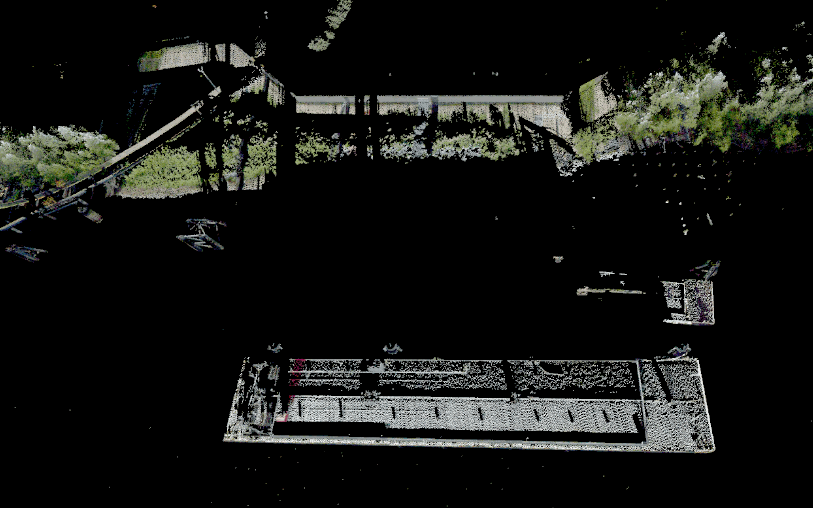

This VR app was built with our [Point Cloud Plugin](/tools/point_cloud_plugin) for Unity.

Using simple two-handed interactions, you can examine and edit your point clouds to remove unwanted noise or objects quickly and intuitively in a fraction of the time it would take on a desktop. You can [read more about our point cloud research](/projects/point_clouds) as well.  
&nbsp;

### >> Download the [VR Point Cloud Cleaner](/downloads/VRPCC-2022.8.12.r1.zip)<<

&nbsp;  
You can also download a [sample point cloud LAZ file](/downloads/sample.laz) to test with.

- [Instructions](#instructions)
- [Controller Layouts](#controls)
- [Settings](#settings)
- [FAQ](#faq)
- [Contact and Bug Reports](#contact)

VRPCC is made available for general use under the [BSD 3-Clause License](https://opensource.org/licenses/BSD-3-Clause).

## Instructions {#instructions}

Point clouds are **loaded** using the user interface (UI) attached to the left-hand controller. Press the `Open UI` button (see controller layouts below) to view the options. Use the right-hand controller to point at a menu item and pull the trigger to select it.

A simple file system browser will open up when you choose to load a point cloud. Navigate to the location of the .las or .laz file you want to open, and either double-click the file or select the file and then click the `Load` button.

It may take some time to process, depending on the file size.

A point cloud can be **unloaded** or **closed** by selecting its filename in the UI dropdown menu, and then clicking the `Close` button.

Interacting with point clouds is easy. Pressing the trigger on your left-hand controller will **grab** the point cloud and allow you to quickly reorient it as desired. **Scaling** the point cloud is done by holding the `Grip` buttons on both controllers (or just the `A` button on the right-hand Valve Index controller) and spreading the controllers farther apart to increase the scale, or bringing them closer together to decrease the scale of the point clouds. Scaling occurs about the midpoint between the two controllers, indicated by a 3D icon that looks like a multicolored jack. Scaling can be a very effective way to move about and examine your point clouds while helping to maintain the overall context of the data.

Once a point cloud has been loaded, we can quickly identify and get rid of most egregious **noise** and **outliers** using the options at the bottom of the UI panel:
* **Distance** sets the minimum distance at which a point will be considered an outlier. Lowering this parameter will cause points closer together to be considered outliers.
* **Neighbors** sets the maximum number of neighboring points contained within the given distance from the candidate point in order for that candidate to still be considered an outlier. For example, a value of 3 would mean that if there are any more than 3 neighboring points within the set distance for the candidate point, it will not be considered an outlier.

Clicking the `Show` button will visualize the outlier points in red. Click the `Delete` button to get rid of the highlighted outlier points.

In addition to the rapid outlier deletion tool, there is a spherical **3D editing cursor** attached to the right-hand controller. This cursor is suitable for large, coarse editing, as well as more precise, fine-grained cleaning tasks. Points within the editing cursor will blink; pressing the trigger on the right-hand controller will **delete** the points within the sphere.

The editing cursor can be **extended** or **retracted** by pushing up or down on the right-hand joystick (or by swiping up or down on the HTC Vive wand's touchpad). The **size** of the editing cursor may also be adjusted by pushing the right-hand joystick to either side, or by swiping your thumb to either side of the HTC Vive wand's touchpad.

Outlier and editing cursor deletions can be **undone** using the assigned `Undo` button on your controller.

To **save** a point cloud, select the dataset from the UI dropdown menu, and click the `Save` button. This will bring up a folder selection browser; select the folder in which you would like the file to be saved, and then click the `Save` button. It will be stored with the original filename and "_edit" appended to it.

Two additional features in the UI enable you to select a custom background color for the environment, and to toggle the visibility of the checkered ground plane in the environment.

To exit the application, press the `Esc` key on the keyboard.

## Maps and Electronic Nautical Charts

The VR point cloud editor can load NOAA Electronic Nautical Charts (ENCs) along with Google and ArcGIS satellite imagery basemaps to aid in identifying point cloud features.

  
_Switching between ENC and Google satellite imagery._

The maps can be activated using the lefthand touchpad or thumbstick. The touchpad or thumbstick is divided up into four sectors (North, East, South, West) that are assigned to activate or deactivate a basemap. Touching the thumbstick within a sector or pushing the thumbstick towards a sector will activate it. The sectors are assigned as follows:

- **North:** No Map
- **East:** ArcGIS WorldImagery
- **South:** NOAA ENC
- **West:** Google Satellite

The height of the basemap can also be interactively adjusted using the assigned button (see controller layouts below).

## Controller Layouts {#controls}

The app supports all major headsets and controllers through SteamVR and OpenXR. If you can run SteamVR content, you will be able to use this app. The following diagrams provide the mappings for the different six-degree-of-freedom controllers.

#### Valve Index

#### HTC Vive Wands

#### Windows Mixed Reality

#### Oculus Quest 2

## Settings and Preferences {#settings}

On first run, the application will generate a file in the application directory named `userPreferences.json` that stores settings and preferences. This file can be edited manually before loading the application to adjust the application's behavior to an individual's preferences.

The following settings can be modified as needed:

- ##### autoHideGroundPlaneOnLoad
  type: `bool`  
  default: `true`  
  When enabled, the ground plane will disappear when a point cloud is loaded.  

- ##### backgroundColor
  type: `normalized RGBA`  
  default: `[0.0, 0.0, 0.0, 1.0]`  
  Sets the background color for the virtual environment.

- ##### cursorDeletionRate
  type: `float`  
  default: `10.0`  
  Controls the rate (in Hz) of deletion commands issued by the editing cursor. Higher values may cause poor performance or crashes.

- ##### cursorDistance
  type: `float`  
  default: `0.25`  
  Sets the initial cursor distance from the controller (meters).

- ##### cursorDistanceMax
  type: `float`  
  default: `1.0`  
  The maximum distance the cursor can be extended from the controller (meters).

- ##### cursorDistanceMin
  type: `float`  
  default: `0.1`  
  The minimum distance the cursor can be extended from the controller (meters).

- ##### cursorRadius
  type: `float`  
  default: `0.05`  
  Initial radius of the editing cursor (meters).

- ##### cursorRadiusMax
  type: `float`  
  default: `0.25`  
  The maximum radius of the editing cursor (meters).  

- ##### cursorRadiusMin
  type: `float`  
  default: `0.01`  
  The minimum radius of the editing cursor (meters).

- ##### distanceOnLoad
  type: `float`  
  default: `0.75`  
  Sets the distance at which the point cloud will be placed from the viewer when loaded or when the view is reset using the UI (meters).

- ##### encResolution
  type: `int`  
  default: `4096`  
  Sets the resolution for ENC basemaps.

- ##### fitSizeOnLoad
  type: `float`  
  default: `1.0`  
  When a point cloud is loaded or the view is reset using the UI, the point cloud will be scaled down to fit within a volume whose maximum dimension is this size (meters) and placed _distanceOnLoad_ away from the viewer.

- ##### lastLoadDirectory
  type: `string`  
  default: `""`  
  Stores the last location a point cloud was loaded from.

- ##### lastSaveDirectory
  type: `string`  
  default: `""`  
  Stores the last location a point cloud was saved to.

- ##### nearPlaneDistance
  type: `float`  
  default: `0.1`  
  Sets the near clipping plane distance from the viewer (meters).

- ##### outlierDistance
  type: `float`  
  default: `5.0`  
  Sets the initial minimum distance at which a point will be considered an outlier (meters). Lowering this parameter will cause points closer together to be considered outliers.

- ##### outlierNeighborCount
  type: `int`  
  default: `5`  
  Sets the initial maximum number of neighboring points contained within the given distance from the candidate point in order for that candidate to still be considered an outlier. For example, a value of 3 would mean that if there are any more than 3 neighboring points within the set distance for the candidate point, it will not be considered an outlier.

- ##### saveCursorOnExit
  type: `bool`  
  default: `true`  
  When enabled, the cursor radius and distance from the controller will be saved to the settings file when the application exits.

- ##### showGroundPlane
  type: `bool`  
  default: `true`  
  Sets whether or not the ground plane is visible when the application starts.

- ##### stickyMaps
  type: `bool`  
  default: `true`  
  When enabled, the touchpad or thumbstick that controls the basemaps can be pressed/clicked to "stick" the basemap so that it persists after the thumb is moved off of the touchpad/thumbstick, and can be clicked again to "unstick" the basemap.
  
  When disabled, the basemap will persist after the thumb is removed from the touchpad or thumbstick; hiding the basemap is achieved by activating the North sector of the touchpad or thumbstick.

- ##### stickyUI
  type: `bool`  
  default: `true`  
  Controls whether the UI button acts as a toggle (true) or momentary switch (false) to display the user interface.

## FAQs {#faq}

How do I lock the cursor size and/or distance?
: In `userPreferences.json`, You can set the cursorRadius and its min and max to all be the same values. The same applies to cursorDistance.  
&nbsp;

## Contact {#contact}

Bug reports, feature requests, and other inquiries can be emailed to Drew Stevens (astevens@ccom.unh.edu) at the VisLab.