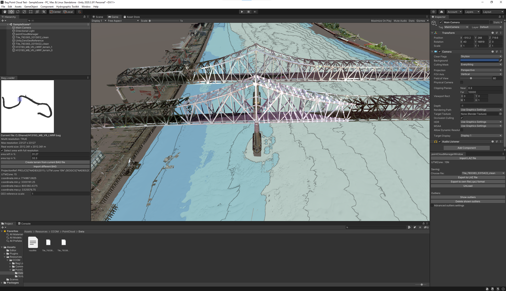
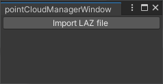
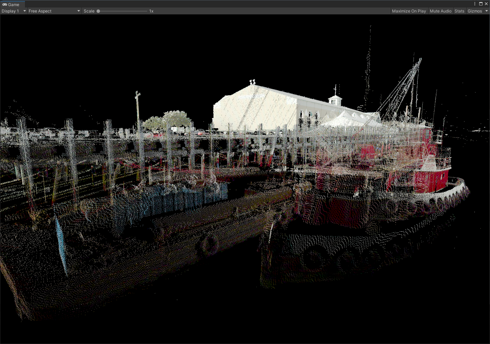
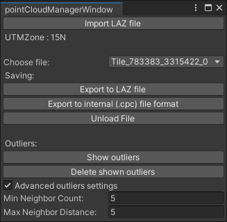

The Point Cloud Plugin for Unity 

**Download the [Point Cloud Plugin for Unity](PointCloudPlugin_20211220.unitypackage)** *(December 20, 2021)*

It is released for general use under the [BSD 3-Clause License](https://opensource.org/licenses/BSD-3-Clause).

  
_Point cloud files can be loaded into any Unity scene._

### Instructions:

* Download the plugin file: **[PointCloudPlugin.unitypackage](PointCloudPlugin_20211220.unitypackage)**
* Load the plugin into your Unity project by going to Assets -> Import Package -> Custom Package in the menu bar, and then selecting the PointCloudPlugin.unitypackage file you downloaded.
* Click the “All” button, then the “Import” button.
* There should now be a “Hydrographic Toolkit” option available on your menu bar. Here you can select the “Point Cloud Manager” tool.
* A manager window will pop up and a GameObject will be added to the scene.
  * **Note:** These components are both necessary to load and display point clouds.
* Click on the "Import LAZ File" button on the point cloud manager window:  

* Locate and open the LAS or LAZ file, and allow the plugin to process the data.
  * **Note:** Large point clouds may take a significant amount of time to process. Please be patient.
* A GameObject called "UnityZeroGeoReference" will be added to the root of the scene. Do not remove this GameObject.
* The point cloud should now be visible in the **Game view window**:  
  
You may need to adjust your camera properties or add camera interaction to your scene to see the full point cloud.
* The manager window will now display options for the loaded point clouds in the dropdown menu:  
  
  * **Saving:** In this section you can save a point cloud as a LAZ file or in a custom format (.cpc) better optimized for fast loading. Point clouds can also be unloaded from the scene using the "Unload File" button.
  * **Outliers:** This section can be used to quickly get rid of outlier or noise points which are located far away from other points. Clicking the "Show outliers" button will color the outlier points red. Clicking the "Delete shown outliers" button will delete any outliers currently being shown. The following parameters allow for finer control over the behavior of the algorithm:
    * Min Neighbor Count: This number determines the "cluster" size for outlier points. If it is set to a value of 4, for example, then a point that has at least 4 other points within the threshold distance will not be considered an outlier.
    * Max Neighbor Distance: This controls the threshold for a point's distance to its closest neighbor in order not to be considered an outlier.

### API Documentation

*Coming soon...*

### Contact

NOAA employees and CCOM industrial partners are encouraged to reach out to us with their particular applications that require support or modifications.  Other uses are welcome to contact us with bug reports and feature requests as well.  You can email the developer, Kindrat Beregovyi at kberegovyi@ccom.unh.edu or the lab director Thomas Butkiewicz at tbutkiewicz@ccom.unh.edu.