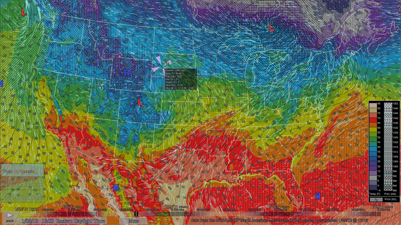

WindVis2 is a weather visualization package designed and developed at CCOM UNH to show the latest weather forecast model data from NOAA NCEP (Specifically the North American Mesoscale (NAM) model). It shows a complete 84-hour forecast (in 3-hour time steps), and is updated with new forecast data every six hours. Instructions for downloading the package are given at the foot of this page.

WindVis2 was developed initially as a design exercise to show winds, pressure and temperature simultaneously. The results were published in Ware, C., and Plumlee, M.D. (2012) [Designing a better weather display](http://vislab-ccom.unh.edu/~tbutkie/PlumleeWeather.pdf). Information Visualization. It was experimentally shown to be superior to more conventional displays.

WindVis2 can either be used as a tool for individuals to check on the current forecast, or it can be configured as a public display, which automatically updates forecasts every six hours.

  
_A still snapshot of our primary view design as implemented in a public display. Temperature is represented by color, while atmospheric pressure is given by contours and a sequence of textures. Animated wind traces show the wind direction and speed. Numbers show wind speed at sample points._

## What it Shows

WindVis2 has three primary views. They can be selected from the menu near the lower-left corner of the application window. The three views are as follows:

1. "Temp. & Pressure" - Surface temperature (color), atmospheric pressure (texture), and surface winds (traces and numbers)

2. "Pressure & Jet Stream" - Atmospheric pressure (texture), surface winds (small dark traces), and jet stream winds (large white traces)

3. "Precip. & Cloud Cover" - Precipitation (color), cloud cover (texture), and surface winds (traces and numbers)

The key on the right side of the application window shows the ranges of values that each color and texture represents.

In any one of the three views, the application supports several forms of interaction.  The user can click anywhere on the main map area to get detailed information about the nearest point in the forecast model. The information updates dynamically as time progresses and as the mouse button is held down and dragged across the map. The information displayed includes: model coordinates (position), temperature, atmospheric pressure, precipitation, cloud cover, surface wind speed, jet stream speed, and surface wind direction.

There is also a time bar and several buttons at the bottom of the screen. Clicking the button in the bottom-left corner toggles the display between play and pause. When paused, time remains still, and the button looks like a play button (triangle). When playing, time advances at a steady rate and the button looks like a pause button (two rectangles). As time advances between forecast-model time steps, data displayed on the map is interpolated between time steps. The time "knob" (a dark rectangle with a lighter line running down the center of it) advances along the length of the time bar to indicate the current time being displayed. This knob can be moved independently. Clicking anywhere on the time bar shuttles the knob to the nearest model time (indicated by the faint tick-marks), and dragging it moves it to an appropriately interpolated time. Data displayed on the map is always consistent with the current position of the time knob. Interaction with the time knob pauses playback.

Depending on the startup arguments, there may be additional buttons in the middle portion of the time bar. One is the "Now" button. When clicked, the "Now" button moves the time knob to time closest to the current system time on the computer and pauses playback. The other button that may appear there is the "Update" button. When clicked, this launches a background process that downloads and processes the latest forecast model from our server. After the background process completes, WindVis2 pauses to load and display the newly updated data. In addition to this on-demand updating, the program can be configured to automatically download updated forecast data every six hours.

Pressing the `Esc` key at any time will close WindVis2.

## Installation Requirements

WindVis2 requires a Windows XP/Vista/7 operating system, a graphics card with hardware shader support (available in most modern gaming graphics cards), and 270MB of available hard drive space.

## Installation Instructions (personal use)

Download the installation program: [WindVis2Installer.exe](/downloads/WindVis2Installer.exe)

Run the installation program.

Launch WindVis2 via the shortcuts added to your desktop or Start menu.

## Installation Instructions (public display use)

If you are setting up a public display, use the following steps:

1. Download the installation package: [WindVis2Installer.exe](/downloads/WindVis2Installer.exe)

2. Run the installation program.

3. Add a shortcut to “C:\WindVis2\Windvis2.exe -p -k2300” to the Startup folder in your Start menu. By default, it is configured to turn itself off at 11:00pm each night. This can be adjusted or disabled by changing the shortcut’s command line arguments:  
**-kHHMM**  
Kill (stop) the program at HH:MM. (Ex: -k2130 would be 9:30pm)  
**-p**  
Public display mode (fullscreen, without ‘update’ button).

4. Make sure you are logged in as the user you want to be active when the display runs.

5. Open up the Windows Task Scheduler (from the Control Panel, for example) and import the following two tasks:  
C:\WindVis2\Demo Forecast Grabber.xml  
C:\WindVis2\Weather Demo.xml

6. Make sure both are starting with the correct user, rather than the "FLAMINGO\demo" user we set it up for.  Also make sure the correct path is set.

7. Make sure the screensaver is disabled for this user.

8. Make sure that in Windows Power Settings the monitor is never turned off after any period of idle time.

## Additional Custom Options

If you want to change the startup options, right-click on a shortcut and select "Properties."  At the end of the "Target:" add one or more of the following option flags.

-fullscreen
: Runs in fullscreen mode (can always hit "Esc" key to quit)

-window 
: Runs in windowed mode (default)

-update
: Always check for updated data upon startup

-kHHMM  
: Kill (stop) the program at HH:MM. (Ex: -k2130 would be 9:30pm)

-k+T  
: Kill (stop) the program after T hours. (Ex: -k+8.5 would be 8.5 hours.)

-p  
: Run in "public display" mode (fullscreen, without "update" button)